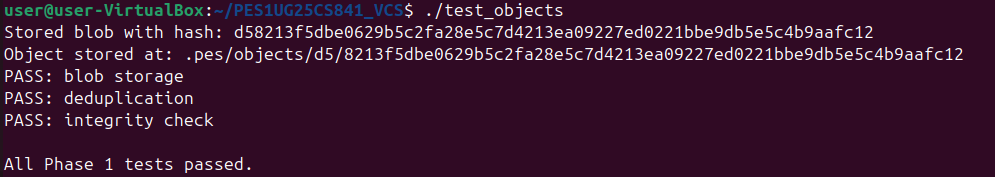
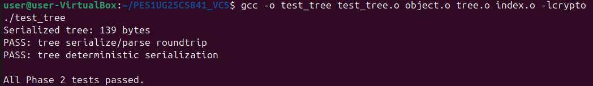
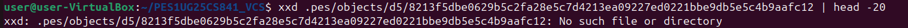
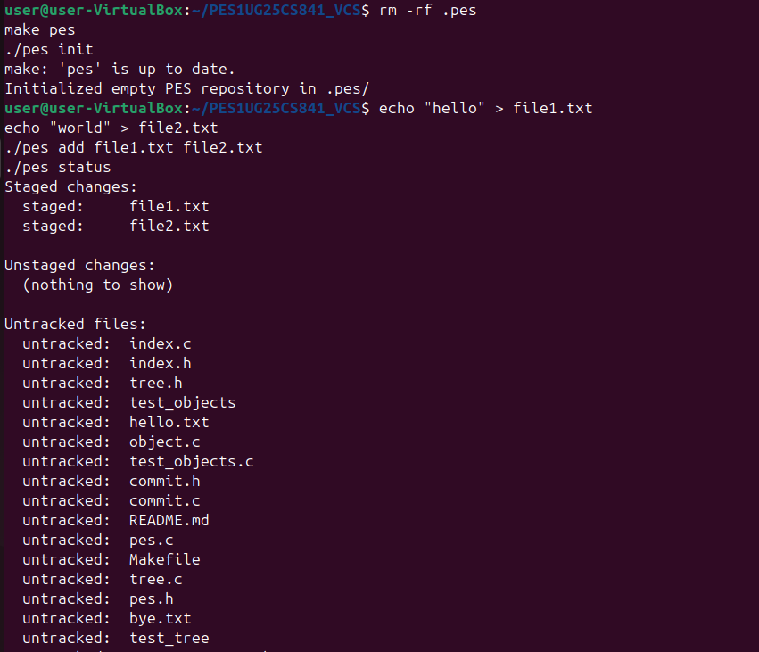
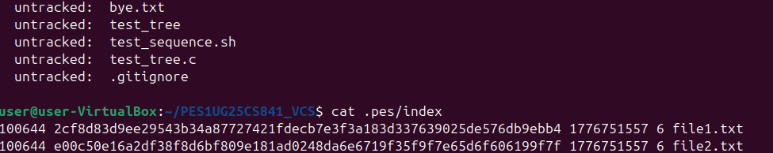
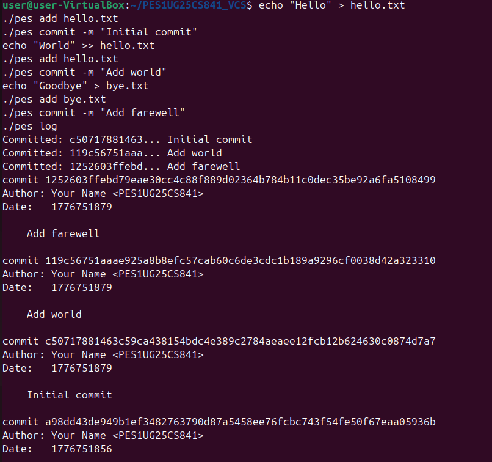
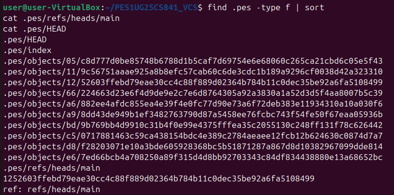
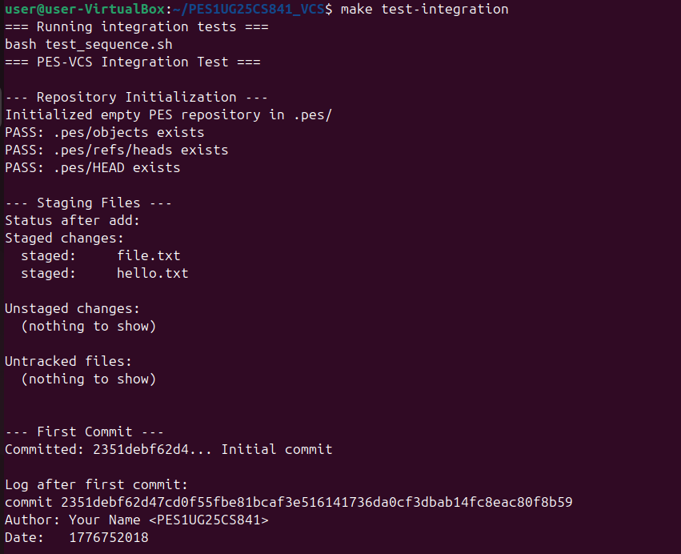
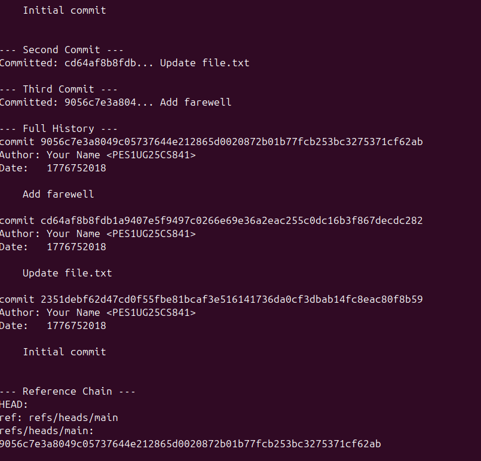
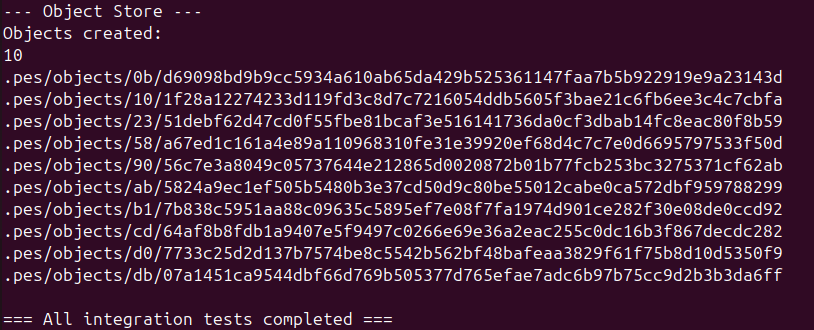

# PES-VCS Lab Report
## Student: PES1UG25CS841

---

## Phase 1: Object Storage Foundation

### Implementation
- Implemented `object_write` in `object.c`
  - Builds header string: "blob/tree/commit size\0"
  - Computes SHA-256 hash of full object
  - Deduplicates using object_exists
  - Writes atomically using temp file + rename
  - Shards into .pes/objects/XX/ directories
- Implemented `object_read` in `object.c`
  - Reads object file from sharded path
  - Verifies integrity by recomputing SHA-256
  - Parses header to extract type and size
  - Returns data portion after the null byte

### Screenshot 1A — test_objects output

### Screenshot 1B — Sharded object store

---

## Phase 2: Tree Objects

### Implementation
- Implemented `tree_from_index` in `tree.c`
  - Loads current index using index_load
  - Recursively builds tree hierarchy using write_tree_level helper
  - Handles nested paths by grouping entries by subdirectory
  - Serializes each tree level and writes to object store
  - Returns root tree hash

### Screenshot 2A — test_tree output

### Screenshot 2B — Raw tree object in hex

---

## Phase 3: Index (Staging Area)

### Implementation
- Implemented `index_load` in `index.c`
  - Opens .pes/index file for reading
  - Returns empty index if file does not exist
  - Parses each line: mode hash mtime size path
  - Converts hex hash string to ObjectID using hex_to_hash
- Implemented `index_save` in `index.c`
  - Builds sorted pointer array to avoid stack overflow
  - Writes to temporary file atomically
  - Uses fsync before rename for crash safety
- Implemented `index_add` in `index.c`
  - Reads file contents and writes blob to object store
  - Gets file metadata using lstat
  - Updates or adds entry in index
  - Calls index_save to persist changes

### Screenshot 3A — pes init, pes add, pes status

### Screenshot 3B — cat .pes/index

---

## Phase 4: Commits and History

### Implementation
- Implemented `commit_create` in `commit.c`
  - Calls tree_from_index to snapshot staged files
  - Reads current HEAD to get parent commit hash
  - Fills Commit struct with tree, parent, author, timestamp, message
  - Serializes commit using commit_serialize
  - Writes commit object using object_write
  - Updates HEAD using head_update

### Screenshot 4A — pes log with three commits

### Screenshot 4B — find .pes -type f showing object growth

### Screenshot 4C — HEAD and refs/heads/main

---

## Integration Test

### Screenshot Final — make test-integration

---

## Analysis Questions

### Q5.1 — How would you implement pes checkout branch?

To switch branches, three things must change in .pes/:
First, read the target branch commit hash from .pes/refs/heads/<branch>.
Second, walk that commits tree and restore every file to the working
directory by reading each blob from the object store and writing it
to the correct path on disk.
Third, update .pes/HEAD to contain ref: refs/heads/<branch>.

What makes this complex is handling files that exist in the current
branch but not in the target branch - those must be deleted from the
working directory. New directories may need to be created and old
empty ones removed. The working directory must exactly match the
target tree when checkout completes.

### Q5.2 — How would you detect a dirty working directory conflict?

Before switching branches, for every file tracked in the current index,
compare its mtime and size metadata against the actual file on disk.
This is the same fast-diff approach used by pes status. If any file
has been modified since it was staged (metadata differs), AND that same
file has a different blob hash between the current branch and the target
branch, then checkout must refuse and print an error message. No
re-hashing is needed - metadata comparison is sufficient for detection.
This protects the user from losing uncommitted local changes.

### Q5.3 — What happens in detached HEAD state and how to recover?

In detached HEAD state, .pes/HEAD contains a raw commit hash directly
instead of ref: refs/heads/main. New commits are created and chained
normally through parent pointers, but no branch file is updated to
track them. If you switch to another branch, those commits become
unreachable because nothing points to them.

To recover, you need the commit hash - visible in terminal history or
via pes log while still in detached state. Then create a new branch
by writing that hash into .pes/refs/heads/<new-branch> and updating
.pes/HEAD to ref: refs/heads/<new-branch>. This makes the commits
reachable again through the new branch pointer.

### Q6.1 — Algorithm to find and delete unreachable objects

The algorithm is mark-and-sweep in three steps:

Step 1 - Mark reachable objects:
Start from every branch tip in .pes/refs/heads/. For each commit,
add its hash to a reachable hash set. Follow its tree pointer: add
the tree hash, recursively add all subtree hashes, add all blob hashes.
Then follow the parent pointer and repeat until no parent exists.

Step 2 - Collect all objects:
List every file under .pes/objects/ by scanning all shard directories.
Reconstruct each full hash from the directory name and filename.

Step 3 - Delete unreachable objects:
Any hash found in Step 2 but not in the reachable set from Step 1
is garbage and can be safely deleted.

The best data structure for the reachable set is a hash set for O(1)
insertion and lookup. For a repository with 100,000 commits and 50
branches, assuming each commit references approximately 50 objects
on average, you would visit roughly 5 million objects total.

### Q6.2 — Race condition between GC and concurrent commit

The race condition works like this:
- At time T1, GC scans all reachable objects and does NOT see a
  newly written blob because no commit references it yet
- At time T2, pes add writes that blob to the object store
- At time T3, pes commit is about to create a commit referencing it
- If GC deletes the blob between T2 and T3, the new commit will
  reference a missing object causing permanent repository corruption

Git avoids this using a grace period strategy: objects newer than
2 weeks are never deleted by GC regardless of reachability. A freshly
written blob is always safe even if no commit references it yet.
Additionally, Git writes the commit object first and only then updates
the branch ref as the final atomic step. GC running before the ref
update will not see the new objects as reachable, but the grace period
protects them from deletion during that window.

---

## Implementation Summary

| Phase | File     | Functions Implemented             |
|-------|----------|-----------------------------------|
| 1     | object.c | object_write, object_read         |
| 2     | tree.c   | tree_from_index                   |
| 3     | index.c  | index_load, index_save, index_add |
| 4     | commit.c | commit_create                     |

